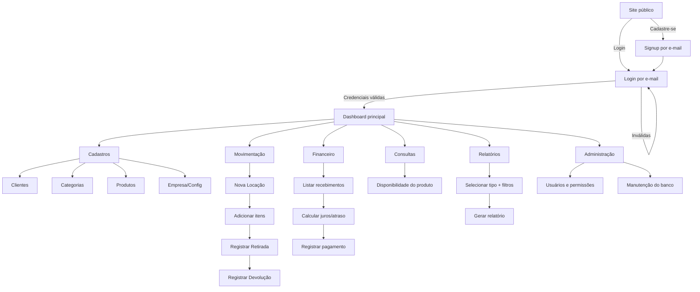
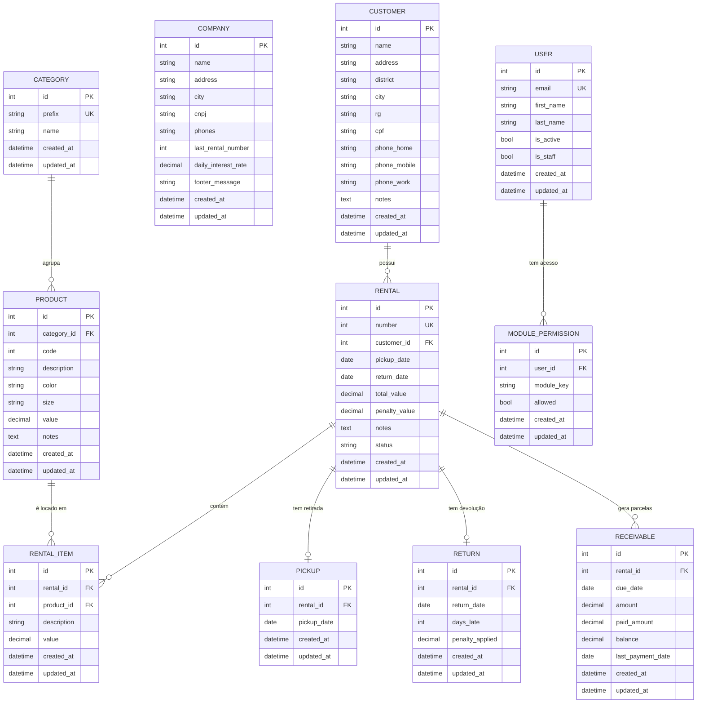

# PRD — Noivas & Cia · Sistema de Gerenciamento Comercial e Locação

> Documento de Requisitos de Produto · v1.0
> Stack: Django full-stack · DTL + TailwindCSS · SQLite

---

## 1. Visão geral

Noivas & Cia é um sistema web de gerenciamento comercial e locação para uma empresa de aluguel de roupas e acessórios para grandes eventos (noivas, festas, formaturas, trajes masculinos). Substitui um sistema legado desktop (BRcom Gerenciamento Comercial), que roda apenas em Windows 98, por uma aplicação web moderna, responsiva e centralizada.

O sistema cobre o ciclo completo de operação: cadastro de clientes e itens do acervo, criação de contratos de locação, controle físico de retirada e devolução, gestão financeira de recebimentos com juros por atraso, consultas de disponibilidade, relatórios de acompanhamento e administração de usuários.

A aplicação é full-stack Django: backend e frontend no mesmo projeto, renderização server-side via Django Template Language (DTL) estilizada com TailwindCSS, persistência em SQLite e autenticação nativa do Django com login por e-mail.

---

## 2. Sobre o produto

O produto é uma aplicação web de uso interno operada pela equipe da loja (atendentes e administração), acrescida de um site público de apresentação que serve como vitrine institucional e ponto de entrada para cadastro e login.

Cada domínio de negócio é isolado em uma app Django, mantendo responsabilidades segregadas. O sistema é deliberadamente enxuto: sem SPA, sem framework CSS pesado, sem serviços externos, sem complexidade não justificada pelos requisitos.

| Característica | Definição |
|---|---|
| Tipo | Aplicação web monolítica server-side |
| Acesso | Interno (operação) + público (apresentação) |
| Renderização | Server-side (DTL) |
| Estilo | TailwindCSS |
| Persistência | SQLite |
| Idioma da UI | Português brasileiro |
| Idioma do código | Inglês |

---

## 3. Propósito

Modernizar e tornar acessível por navegador a operação atual, eliminando a dependência de um sistema legado preso ao Windows 98, reduzindo riscos de perda de dados e indisponibilidade, e oferecendo uma interface moderna, responsiva e padronizada que diminua o tempo de atendimento e o erro operacional.

Objetivos do propósito:
- Eliminar a dependência de hardware/SO legado.
- Centralizar dados de clientes, acervo, contratos e financeiro em um único banco.
- Padronizar a operação com uma identidade visual única e fluxos consistentes.
- Tornar a operação acessível de qualquer máquina com navegador na rede local.

---

## 4. Público-alvo

| Persona | Descrição | Necessidade principal |
|---|---|---|
| Atendente | Opera locações, retiradas, devoluções e recebimentos no balcão | Telas rápidas, fluxo direto, pouca digitação |
| Administrador | Gerencia acervo, configurações da empresa, usuários e permissões | Controle total, relatórios, manutenção |
| Visitante (site público) | Conhece a empresa e cria conta / faz login | Apresentação clara e acesso fácil |

---

## 5. Objetivos

1. Entregar um sistema web funcional cobrindo cadastros, movimentação, financeiro, consultas, relatórios, usuários e manutenção.
2. Garantir autenticação nativa do Django com login por e-mail.
3. Manter arquitetura modular por apps Django, simples e de baixa manutenção.
4. Aplicar um design system único, moderno, responsivo e de fundo claro a todas as telas.
5. Assegurar UI 100% em português brasileiro e código 100% em inglês, aderente à PEP 8.
6. Postergar Docker e testes automatizados para as sprints finais, mantendo o MVP enxuto.

---

## 6. Requisitos funcionais

Os requisitos estão agrupados por módulo. Cada módulo corresponde a uma ou mais apps Django (ver seção 8.3).

### 6.1 Site público (`website`)
- RF-01: Exibir página inicial pública de apresentação da empresa.
- RF-02: Oferecer ação "Cadastre-se" levando ao formulário de registro.
- RF-03: Oferecer ação "Login" levando à autenticação por e-mail.
- RF-04: Após login bem-sucedido, redirecionar ao dashboard principal.

### 6.2 Autenticação e usuários (`accounts`)
- RF-05: Autenticar usuários por e-mail e senha (sem username).
- RF-06: Registrar novos usuários (signup) com e-mail único.
- RF-07: Encerrar sessão (logout).
- RF-08: Listar usuários e gerenciar acesso por módulo (liberação de programas).
- RF-09: Restringir acesso a módulos conforme permissão do usuário.

### 6.3 Dashboard (`core`)
- RF-10: Apresentar dashboard com atalhos para os módulos e indicadores resumidos (locações a retirar, a devolver, recebimentos em aberto).

### 6.4 Cadastros
- RF-11: CRUD de **Clientes** (`customers`): nome, endereço, bairro, cidade, RG, CPF, fones (residencial, celular, comercial), observações.
- RF-12: CRUD de **Categorias** (`catalog`): prefixo (sigla) + nome.
- RF-13: CRUD de **Produtos** (`catalog`): categoria (prefixo), código, descrição, cor, tamanho, valor, observações.
- RF-14: Edição da **Empresa/Configuração** (`company`): nome, endereço, cidade, CNPJ, telefones, número da última locação (sequencial), taxa de juros ao dia, mensagem de rodapé. Registro único (singleton).

### 6.5 Locação e movimentação (`rentals`, `movements`)
- RF-15: Criar **Locação** vinculando cliente, itens, datas de retirada e retorno, valores, multa, observações; gerar número sequencial a partir da configuração da empresa.
- RF-16: Adicionar/remover **itens da locação** (produto, descrição/cor/tamanho, valor).
- RF-17: Registrar **Retirada** dos itens de uma locação em uma data.
- RF-18: Registrar **Devolução** dos itens, calculando atraso e multa quando aplicável.

### 6.6 Financeiro (`billing`)
- RF-19: Gerar e listar **Recebimentos** (parcelas) por locação: vencimento, valor, valor pago, saldo.
- RF-20: Calcular **juros por dia de atraso** com base na taxa configurada na empresa e exibir valor total com juros.
- RF-21: Registrar pagamento de uma parcela, atualizando valor pago, saldo e data do último pagamento.

### 6.7 Consultas (`catalog`)
- RF-22: **Ver disponibilidade do produto**: dado prefixo/código e data, indicar se está disponível ou locado, mostrando locação, cliente, retirada e retorno.

### 6.8 Relatórios (`reports`)
- RF-23: Gerar relatório de **acompanhamento** por tipo: A Retirar, Retirados, Devolvidos, Não Devolvidos, Histórico por prefixo.
- RF-24: Filtrar relatórios por data inicial, data final e prefixo/código.

### 6.9 Manutenção (`maintenance`)
- RF-25: Disponibilizar área administrativa restrita para rotinas controladas de manutenção do banco (uso exclusivo do administrador).

### 6.10 Flowchart Mermaid — fluxos de UX principais



---

## 7. Requisitos não-funcionais

| ID | Categoria | Requisito |
|---|---|---|
| RNF-01 | Desempenho | Respostas de página em até 1s em rede local com base de dados típica da loja |
| RNF-02 | Usabilidade | Fluxos consistentes; ações primárias visíveis; mínimo de cliques no balcão |
| RNF-03 | Responsividade | Layout adaptável a desktop, tablet e mobile via utilitários Tailwind |
| RNF-04 | Segurança | Autenticação nativa do Django; proteção CSRF; controle de acesso por módulo; senhas com hashing padrão |
| RNF-05 | Manutenibilidade | Apps isoladas por domínio; CBVs; PEP 8; aspas simples; código em inglês |
| RNF-06 | Internacionalização | UI 100% em português brasileiro |
| RNF-07 | Consistência visual | Design system único aplicado a todas as telas |
| RNF-08 | Simplicidade | Sem SPA, sem CSS framework além do Tailwind, sem dependências não justificadas |
| RNF-09 | Portabilidade | Execução em qualquer SO com Python/Django; SQLite embutido |

---

## 8. Arquitetura técnica

### 8.1 Stack

| Camada | Tecnologia | Versão alvo | Justificativa |
|---|---|---|---|
| Linguagem | Python | 3.12+ | LTS atual, performático |
| Framework | Django | 5.x | Full-stack, ORM, auth e admin nativos |
| Templates | Django Template Language | — | Renderização server-side, sem SPA |
| Estilo | TailwindCSS | 3.x | Utilitário, consistência, sem CSS custom disperso |
| Banco | SQLite | nativo Django | Zero configuração, suficiente para o volume da loja |
| Auth | `django.contrib.auth` | nativo | Sem reinvenção; custom user para login por e-mail |

Princípios: full-stack monolítico, CBVs e recursos nativos do Django sempre que possível, signals em `signals.py` da app correspondente, nenhuma abstração prematura.

### 8.2 Estrutura de dados (Mermaid erDiagram)

Todos os models herdam de um `TimeStampedModel` abstrato em `core`, garantindo `created_at` (auto_now_add) e `updated_at` (auto_now) em todas as tabelas.



### 8.3 Mapa de apps Django

| App | Responsabilidade | Models |
|---|---|---|
| `core` | Base abstrata, dashboard, mixins, layout/base templates | `TimeStampedModel` (abstract) |
| `accounts` | Usuário customizado (login por e-mail), signup, login/logout, permissões por módulo | `User`, `ModulePermission` |
| `website` | Site público de apresentação, entrada para signup/login | — |
| `customers` | Cadastro de clientes | `Customer` |
| `catalog` | Categorias, produtos e consulta de disponibilidade | `Category`, `Product` |
| `company` | Configuração singleton da empresa | `Company` |
| `rentals` | Locações e itens da locação | `Rental`, `RentalItem` |
| `movements` | Retiradas e devoluções | `Pickup`, `Return` |
| `billing` | Recebimentos, parcelas e juros por atraso | `Receivable` |
| `reports` | Relatórios de acompanhamento (sem models próprios) | — |
| `maintenance` | Rotinas administrativas controladas | — |

> Observação anti-over-engineering: `Category` e `Product` coabitam a app `catalog` por pertencerem ao mesmo domínio (catálogo). A consulta de disponibilidade é uma view em `catalog`, não uma app dedicada.

---

## 9. Design system

Identidade visual única, clara e operacional. A interface usa uma base neutra, alta legibilidade e acento de marca controlado para ações principais, foco e links. O objetivo visual é apoiar atendimento rápido, leitura de tabelas, preenchimento de formulários e conferência de valores, sem decoração que dispute atenção com os dados.

### 9.1 Paleta de cores

| Token | Uso | Hex | Tailwind |
|---|---|---|---|
| Background | Fundo da aplicação | `#F6F7F9` | `app-bg` |
| Surface | Painéis, tabelas e formulários | `#FFFFFF` | `app-surface` |
| Panel | Áreas sutis e tiles internos | `#F8FAFC` | `app-panel` |
| Ink | Texto principal | `#111827` | `app-ink` |
| Muted | Texto secundário | `#475569` | `app-muted` |
| Border | Bordas funcionais | `#CBD5E1` | `app-border` |
| Brand | Ações primárias e links | `#9F1239` | `brand-700` |
| Brand hover | Hover/active primário | `#881337` | `brand-800` |
| Focus | Anel de foco | `#FDA4B5` | `brand-300` |
| Success | Confirmações | `emerald-800` sobre `emerald-50` | `badge-success`, `alert-success` |
| Danger | Erros e exclusões | `red-800` sobre `red-50` | `badge-danger`, `alert-error` |
| Warning | Atenção | `amber-800` sobre `amber-50` | `badge-warning`, `alert-warning` |
| Info | Informação neutra | `sky-800` sobre `sky-50` | `badge-info`, `alert-info` |

Gradientes não são padrão do produto. O acento de marca deve aparecer apenas em ações principais, links, foco e pequenos estados de seleção.

### 9.2 Tipografia

- Fonte: **Inter** (fallback `system-ui, sans-serif`).
- Títulos de página: `page-title` (`text-2xl`, peso 600, `text-app-ink`).
- Subtítulos e descrições: `page-description` (`text-sm`, altura de linha 1.5, `text-app-muted`).
- Corpo e dados: `text-sm text-slate-700`; valores importantes usam `font-medium` ou `font-semibold`.
- Rótulos de formulário: `field-label`, sem caixa alta e com contraste suficiente.
- Indicadores: `stat-label` + `stat-value`, com peso forte apenas no valor.
- Cabeçalhos de tabela: `text-xs font-semibold text-slate-600`, sem caixa alta obrigatória.

### 9.3 Botões

```html
<!-- Primário -->
<button class="btn btn-primary">
  Salvar
</button>

<!-- Secundário -->
<button class="btn btn-secondary">
  Cancelar
</button>

<!-- Perigo -->
<button class="btn btn-danger">
  Excluir
</button>
```

### 9.4 Inputs e forms

```html
<div class="field-group">
  <label class="field-label">Nome do cliente</label>
  <input type="text"
         class="field-input"
         placeholder="Digite o nome">
  <p class="field-help">Texto auxiliar opcional.</p>
  <p class="field-error">Mensagem de erro.</p>
</div>

<form class="grid grid-cols-1 gap-4 md:grid-cols-2">
  <!-- campos -->
</form>
```

### 9.5 Cards e grids

```html
<div class="panel-spacious">
  <h2 class="text-lg font-semibold text-app-ink">Título do painel</h2>
  <div class="mt-4 grid grid-cols-1 gap-4 sm:grid-cols-2 lg:grid-cols-3">
    <!-- itens -->
  </div>
</div>
```

Use `panel` para painéis compactos, `panel-spacious` para formulários e blocos principais, `surface-section` para seções leves e `module-tile` para atalhos internos. Evite borda e sombra no mesmo componente.

### 9.6 Menu / navegação

```html
<aside class="flex h-screen w-64 flex-col border-r border-slate-800 bg-slate-950 text-slate-100">
  <div class="px-6 py-5 text-lg font-semibold">Noivas &amp; Cia</div>
  <nav class="flex-1 space-y-1 px-3">
    <p class="nav-section">Cadastros</p>
    <a href="#" class="nav-link">Clientes</a>
    <a href="#" class="nav-link">Produtos</a>
  </nav>
</aside>
```

### 9.7 Tabelas (listagens)

```html
<div class="table-shell">
  <table class="data-table">
    <thead>
      <tr><th>Prefixo</th><th>Categoria</th></tr>
    </thead>
    <tbody>
      <tr><td>VN</td><td>Vestidos de Noivas</td></tr>
      <tr><td colspan="2" class="table-empty">Nenhum resultado.</td></tr>
    </tbody>
  </table>
</div>
```

Todos os componentes acima vivem em `static/src/input.css` dentro de `@layer components`. Campos gerados por forms Django devem usar `core.ui.INPUT_CLASS`, que aponta para `field-input`.

---

## 10. User stories

### Épico 1 — Autenticação e acesso
- **US-1.1**: Como visitante, quero me cadastrar com meu e-mail para acessar o sistema.
  - Critérios: e-mail único validado; senha confirmada; redireciona ao login após sucesso; mensagens em pt-BR.
- **US-1.2**: Como usuário, quero fazer login com e-mail e senha para acessar o dashboard.
  - Critérios: autenticação por e-mail (não username); erro claro em credenciais inválidas; redireciona ao dashboard em sucesso.
- **US-1.3**: Como usuário, quero sair do sistema com segurança.
  - Critérios: logout encerra sessão e retorna à página pública.

### Épico 2 — Cadastros
- **US-2.1**: Como atendente, quero cadastrar, editar e listar clientes.
  - Critérios: todos os campos do domínio; validação de CPF/RG opcional; listagem paginada e pesquisável.
- **US-2.2**: Como administrador, quero cadastrar categorias com prefixo e nome.
  - Critérios: prefixo único; usado na vinculação de produtos.
- **US-2.3**: Como administrador, quero cadastrar produtos vinculados a uma categoria.
  - Critérios: categoria obrigatória; código, descrição, cor, tamanho, valor; listagem filtrável por prefixo.
- **US-2.4**: Como administrador, quero editar os dados da empresa.
  - Critérios: registro único; taxa de juros e número da última locação persistidos.

### Épico 3 — Locação e movimentação
- **US-3.1**: Como atendente, quero criar uma locação com cliente, itens e datas.
  - Critérios: número sequencial gerado; itens adicionáveis/removíveis; valores somados.
- **US-3.2**: Como atendente, quero registrar a retirada dos itens.
  - Critérios: data registrada; status da locação atualizado para "Retirado".
- **US-3.3**: Como atendente, quero registrar a devolução e o cálculo de atraso.
  - Critérios: dias de atraso e multa calculados; status atualizado para "Devolvido".

### Épico 4 — Financeiro
- **US-4.1**: Como atendente, quero ver os recebimentos de um cliente/locação.
  - Critérios: vencimento, valor, pago, saldo e juros exibidos; total com juros calculado.
- **US-4.2**: Como atendente, quero registrar pagamentos de parcelas.
  - Critérios: paid_amount e balance atualizados; data do último pagamento registrada.

### Épico 5 — Consultas e relatórios
- **US-5.1**: Como atendente, quero consultar a disponibilidade de um produto em uma data.
  - Critérios: indica disponível/locado; mostra locação, cliente, retirada e retorno quando locado.
- **US-5.2**: Como administrador, quero gerar relatórios de acompanhamento filtrados.
  - Critérios: tipos A Retirar/Retirados/Devolvidos/Não Devolvidos/Histórico; filtro por datas e prefixo/código.

### Épico 6 — Administração
- **US-6.1**: Como administrador, quero gerenciar usuários e suas permissões por módulo.
  - Critérios: liberar/bloquear acesso por módulo; usuários sem permissão não acessam o módulo.
- **US-6.2**: Como administrador, quero executar rotinas de manutenção controladas.
  - Critérios: área restrita a administradores; ações registradas.

### Épico 7 — Site público
- **US-7.1**: Como visitante, quero conhecer a empresa e encontrar opções de cadastro e login.
  - Critérios: página de apresentação responsiva com CTAs de "Cadastre-se" e "Login".

---

## 11. Métricas de sucesso

| Tipo | KPI | Meta |
|---|---|---|
| Produto | Migração completa do legado | 100% dos fluxos cobertos |
| Produto | Disponibilidade do sistema | ≥ 99% em horário comercial |
| Usuário | Tempo médio para criar uma locação | < 2 min |
| Usuário | Erros de operação por dia | Redução vs. legado |
| Operacional | Locações registradas via novo sistema | 100% após go-live |
| Operacional | Recebimentos em atraso identificados | Visibilidade em 1 clique |
| Técnico | Conformidade PEP 8 | 100% do código |
| Técnico | Cobertura de testes (sprints finais) | ≥ 70% dos fluxos críticos |

---

## 12. Riscos e mitigações

| Risco | Impacto | Probabilidade | Mitigação |
|---|---|---|---|
| Migração de dados do legado (Win98) | Alto | Média | Definir export/import em sprint dedicada; validar amostras |
| Limites de concorrência do SQLite | Médio | Baixa | Volume da loja é baixo; reavaliar SGBD só se necessário |
| Escopo crescer (over-engineering) | Médio | Média | Regras anti-over-engineering; nada além do solicitado |
| Cálculo de juros/multa incorreto | Alto | Média | Centralizar regra em serviço único; validar com exemplos reais |
| Permissões por módulo inconsistentes | Médio | Média | Mixin único de verificação de acesso reutilizado nas CBVs |
| Adoção pela equipe | Médio | Baixa | UI consistente e simples; treinamento no go-live |

---

## 13. Lista de tarefas

> Marcação: `- [ ]` pendente · `- [x]` concluído. Docker e testes aparecem apenas nas sprints finais.

### Sprint 0 — Fundação do projeto
- [x] 0.1 Inicializar projeto Django
  - [x] 0.1.1 Criar virtualenv com Python 3.12 e instalar Django 5.x
  - [x] 0.1.2 Criar projeto `noivas_cia` e configurar `settings` base
  - [x] 0.1.3 Configurar `LANGUAGE_CODE='pt-br'` e `TIME_ZONE='America/Sao_Paulo'`
  - [x] 0.1.4 Configurar SQLite como banco padrão
  - [x] 0.1.5 Configurar diretórios `templates/` e `static/` globais
- [x] 0.2 Configurar TailwindCSS
  - [x] 0.2.1 Adicionar Tailwind (CLI/build) e arquivo de entrada CSS
  - [x] 0.2.2 Configurar `content` apontando para templates DTL
  - [x] 0.2.3 Definir tokens da paleta (cores, fonte Inter) no config do Tailwind
  - [x] 0.2.4 Validar build de CSS e carregamento no template base
- [x] 0.3 Criar app `core` e base abstrata
  - [x] 0.3.1 Criar app `core`
  - [x] 0.3.2 Implementar `TimeStampedModel` abstrato (`created_at`, `updated_at`)
  - [x] 0.3.3 Criar `templates/base.html` com layout (sidebar + área de conteúdo)
  - [x] 0.3.4 Criar parciais em `templates/includes/` (botões, inputs, tabela, alerts)
  - [x] 0.3.5 Criar mixin de verificação de acesso por módulo (placeholder)

### Sprint 1 — Autenticação e usuários
- [x] 1.1 Custom user por e-mail
  - [x] 1.1.1 Criar app `accounts`
  - [x] 1.1.2 Implementar `User` customizado com `email` como `USERNAME_FIELD`
  - [x] 1.1.3 Implementar `UserManager` customizado (`create_user`, `create_superuser`)
  - [x] 1.1.4 Configurar `AUTH_USER_MODEL` no settings
  - [x] 1.1.5 Rodar migração inicial do usuário
- [x] 1.2 Fluxos de autenticação
  - [x] 1.2.1 View/form de signup por e-mail (CBV `CreateView`)
  - [x] 1.2.2 View de login por e-mail (`LoginView` com backend de e-mail)
  - [x] 1.2.3 View de logout (`LogoutView`)
  - [x] 1.2.4 Templates de signup/login no design system
  - [x] 1.2.5 Redirecionamento pós-login para o dashboard
- [x] 1.3 Permissões por módulo
  - [x] 1.3.1 Implementar model `ModulePermission`
  - [x] 1.3.2 Implementar mixin real de verificação de acesso por módulo
  - [x] 1.3.3 Tela de gestão de usuários e liberação de módulos (admin)

### Sprint 2 — Site público e dashboard
- [x] 2.1 Site público
  - [x] 2.1.1 Criar app `website`
  - [x] 2.1.2 View e template da página de apresentação (responsiva)
  - [x] 2.1.3 CTAs "Cadastre-se" e "Login" ligados às rotas de `accounts`
- [x] 2.2 Dashboard
  - [x] 2.2.1 View do dashboard protegida por login (`LoginRequiredMixin`)
  - [x] 2.2.2 Cards de atalho para módulos
  - [x] 2.2.3 Indicadores resumidos (a retirar, a devolver, recebimentos em aberto) — placeholders ligados nas sprints seguintes

### Sprint 3 — Cadastro de clientes
- [x] 3.1 Model e migração
  - [x] 3.1.1 Criar app `customers`
  - [x] 3.1.2 Implementar model `Customer` com todos os campos do domínio
  - [x] 3.1.3 Migração
- [x] 3.2 CRUD com CBVs
  - [x] 3.2.1 `ListView` com busca por nome/CPF e paginação
  - [x] 3.2.2 `CreateView` com `ModelForm`
  - [x] 3.2.3 `UpdateView`
  - [x] 3.2.4 `DeleteView` com confirmação
  - [x] 3.2.5 Templates no design system (form em grid responsivo)

### Sprint 4 — Catálogo (categorias e produtos)
- [x] 4.1 Categorias
  - [x] 4.1.1 Criar app `catalog`
  - [x] 4.1.2 Model `Category` (prefixo único + nome)
  - [x] 4.1.3 CRUD CBV de categorias + templates
- [x] 4.2 Produtos
  - [x] 4.2.1 Model `Product` (FK para `Category`, código, descrição, cor, tamanho, valor, notes)
  - [x] 4.2.2 CRUD CBV de produtos + templates
  - [x] 4.2.3 Filtro de listagem por prefixo de categoria

### Sprint 5 — Empresa / configuração
- [x] 5.1 Model singleton
  - [x] 5.1.1 Criar app `company`
  - [x] 5.1.2 Model `Company` (dados, último número de locação, taxa de juros, rodapé)
  - [x] 5.1.3 Garantir instância única (singleton)
- [x] 5.2 Edição
  - [x] 5.2.1 `UpdateView` da configuração + template
  - [x] 5.2.2 Helper para obter/gerar próximo número de locação

### Sprint 6 — Locações e itens
- [x] 6.1 Models
  - [x] 6.1.1 Criar app `rentals`
  - [x] 6.1.2 Model `Rental` (número, cliente FK, datas, valores, multa, status, notes)
  - [x] 6.1.3 Model `RentalItem` (rental FK, product FK, descrição, valor)
  - [x] 6.1.4 Migração
- [x] 6.2 Fluxo de criação
  - [x] 6.2.1 `CreateView` de locação com geração de número sequencial
  - [x] 6.2.2 Adição/remoção de itens (formset)
  - [x] 6.2.3 Cálculo de valor total da locação
  - [x] 6.2.4 `ListView` e `DetailView` de locações
  - [x] 6.2.5 Templates no design system

### Sprint 7 — Movimentação (retirada e devolução)
- [x] 7.1 Models
  - [x] 7.1.1 Criar app `movements`
  - [x] 7.1.2 Models `Pickup` e `Return`
- [x] 7.2 Retirada
  - [x] 7.2.1 View para registrar retirada (data + atualização de status)
  - [x] 7.2.2 Template de retirada
- [x] 7.3 Devolução
  - [x] 7.3.1 Serviço de cálculo de dias de atraso e multa
  - [x] 7.3.2 View para registrar devolução
  - [x] 7.3.3 Template de devolução
  - [x] 7.3.4 `signals.py` (se necessário) para sincronizar status da locação

### Sprint 8 — Financeiro
- [x] 8.1 Recebimentos
  - [x] 8.1.1 Criar app `billing`
  - [x] 8.1.2 Model `Receivable` (rental FK, vencimento, valor, pago, saldo, último pagamento)
  - [x] 8.1.3 Geração de parcelas a partir da locação
- [x] 8.2 Juros e pagamentos
  - [x] 8.2.1 Serviço único de cálculo de juros por dia de atraso (taxa da empresa)
  - [x] 8.2.2 View de listagem de recebimentos com total c/ juros
  - [x] 8.2.3 View de registro de pagamento (atualiza pago/saldo/data)
  - [x] 8.2.4 Templates no design system

### Sprint 9 — Consultas e relatórios
- [x] 9.1 Disponibilidade
  - [x] 9.1.1 View de consulta de disponibilidade por prefixo/código e data
  - [x] 9.1.2 Lógica de verificação contra locações ativas
  - [x] 9.1.3 Template exibindo locação/cliente/retirada/retorno
- [x] 9.2 Relatórios
  - [x] 9.2.1 Criar app `reports`
  - [x] 9.2.2 View com seleção de tipo (A Retirar/Retirados/Devolvidos/Não Devolvidos/Histórico)
  - [x] 9.2.3 Filtros por data inicial/final e prefixo/código
  - [x] 9.2.4 Templates de resultado por tipo de relatório
  - [x] 9.2.5 Ligar indicadores do dashboard às consultas reais

### Sprint 10 — Administração e manutenção
- [x] 10.1 Permissões
  - [x] 10.1.1 Refinar tela de usuários e liberação por módulo
  - [x] 10.1.2 Aplicar mixin de acesso a todas as views de módulo
- [x] 10.2 Manutenção
  - [x] 10.2.1 Criar app `maintenance`
  - [x] 10.2.2 Área administrativa restrita a administradores
  - [x] 10.2.3 Rotinas controladas de manutenção do banco

### Sprint 11 — Refino de UI/UX
- [x] 11.1 Consistência visual
  - [x] 11.1.1 Auditar todas as telas contra o design system
  - [x] 11.1.2 Padronizar mensagens de feedback (sucesso/erro) em pt-BR
  - [x] 11.1.3 Revisar responsividade (mobile/tablet/desktop)
- [x] 11.2 Acabamento
  - [x] 11.2.1 Estados vazios e de carregamento
  - [x] 11.2.2 Validações de formulário e mensagens claras

### Sprint 12 (final) — Testes
- [x] 12.1 Estrutura de testes
  - [x] 12.1.1 Configurar runner de testes do Django
  - [x] 12.1.2 Testes de models (campos, validações, timestamps)
- [x] 12.2 Testes de fluxo
  - [x] 12.2.1 Testes de autenticação por e-mail
  - [x] 12.2.2 Testes de criação de locação e itens
  - [x] 12.2.3 Testes de cálculo de juros/multa
  - [x] 12.2.4 Testes de permissões por módulo

### Sprint 13 (final) — Docker e deploy
- [x] 13.1 Containerização
  - [x] 13.1.1 Criar `Dockerfile` do app
  - [x] 13.1.2 Criar `docker-compose.yml` (app + volume SQLite)
  - [x] 13.1.3 Configurar coleta de estáticos para produção
- [x] 13.2 Preparo de deploy
  - [x] 13.2.1 Variáveis de ambiente e `DEBUG=False`
  - [x] 13.2.2 Documentar execução local e em container no README
