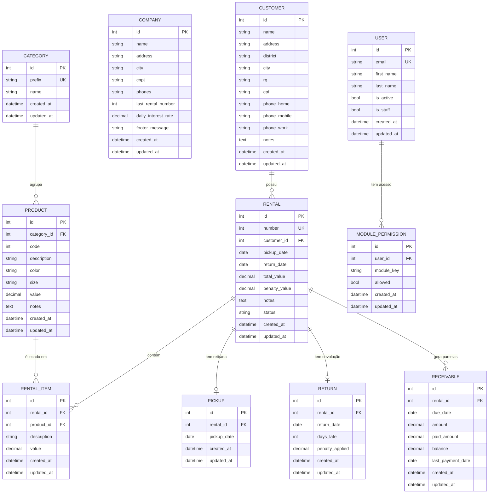

# Arquitetura

Cada domínio de negócio é isolado em uma app Django, mantendo responsabilidades segregadas.

## Mapa de apps

| App | Responsabilidade | Models |
|---|---|---|
| `core` | Base abstrata, dashboard, mixins, templates de layout | `TimeStampedModel` (abstrato) |
| `accounts` | Usuário customizado (login por e-mail), signup, login/logout, permissões por módulo | `User`, `ModulePermission` |
| `website` | Site público de apresentação, entrada para signup/login | — |
| `customers` | Cadastro de clientes | `Customer` |
| `catalog` | Categorias, produtos e consulta de disponibilidade | `Category`, `Product` |
| `company` | Configuração singleton da empresa | `Company` |
| `rentals` | Locações e itens da locação | `Rental`, `RentalItem` |
| `movements` | Retiradas e devoluções | `Pickup`, `Return` |
| `billing` | Recebimentos, parcelas e juros por atraso | `Receivable` |
| `reports` | Relatórios de acompanhamento (sem models próprios) | — |
| `maintenance` | Rotinas administrativas controladas | — |

> `Category` e `Product` coabitam a app `catalog` por pertencerem ao mesmo domínio. A consulta de disponibilidade é uma view em `catalog`, não uma app dedicada.

## Convenções estruturais

Estas convenções atravessam várias apps e devem ser seguidas sempre:

- **Todos os models herdam de `core.TimeStampedModel`** (abstrato), que fornece `created_at` (`auto_now_add`) e `updated_at` (`auto_now`) em todas as tabelas.
- **Class-Based Views (CBVs) em todo lugar.** Usar as views genéricas do Django (`ListView`, `CreateView`, `UpdateView`, `DeleteView`, `DetailView`) e recursos nativos antes de escrever código próprio.
- **Controle de acesso por módulo é um único mixin reutilizável** (em `core`), aplicado a toda view de módulo. A permissão por usuário fica em `accounts.ModulePermission` (`user`, `module_key`, `allowed`). Não reimplementar a checagem por view.
- **Cálculo de juros/multa fica em um único serviço**, não espalhado. Juros de atraso = taxa diária (`Company.daily_interest_rate`) × dias de atraso. Centralizar a regra evita inconsistência.
- **Numeração de locação** é sequencial, baseada em `Company.last_rental_number` (singleton). Gerar o próximo número por um helper em `company`; não duplicar a lógica de incremento.
- **`Company` é singleton** — garantir uma única linha.
- **Signals ficam no `signals.py` da app correspondente** (ex.: sincronizar `Rental.status` na retirada/devolução). Adicionar apenas quando realmente necessário.

## Modelo de dados

Diagrama de entidades e relacionamentos (`erDiagram`):

