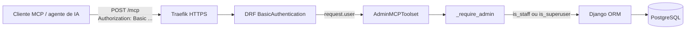
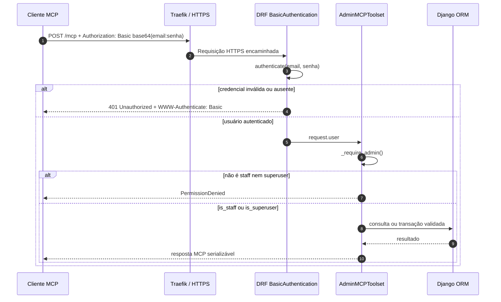

# MCP administrativo do Django

## Visão geral

O Model Context Protocol (MCP) permite que um cliente de IA descubra e invoque
operações tipadas. Neste projeto, o endpoint `/mcp` oferece um catálogo
administrativo centralizado sobre o ORM do Django: descoberta de entidades,
CRUD completo e indicadores operacionais.

A integração é opcional. `noivas_cia/settings.py` só instala o DRF e o
`mcp_server` quando os dois módulos existem. Sem as dependências, o Django sobe
normalmente, `MCP_ENABLED=False` e `/mcp` não é registrado.



O `mcp_server` executa `autodiscover_modules('mcp')`. Como
`core.apps.CoreConfig` está em `INSTALLED_APPS`, `core/mcp.py` é descoberto no
boot e sua classe `AdminMCPToolset` é registrada.

## Autenticação e autorização

O endpoint usa `rest_framework.authentication.BasicAuthentication`. O login é o
e-mail do usuário, pois `accounts.User.USERNAME_FIELD = 'email'`. A senha é
validada pelo backend padrão do Django; não existe credencial paralela nem token
estático no código.



Todas as tools públicas chamam `_require_admin()` antes de consultar ou alterar
o banco. A regra é `is_staff or is_superuser`. Um usuário comum autenticado não
consegue usar nenhuma tool.

## Catálogo de entidades

Os slugs são estáveis, em inglês e `snake_case`:

| Slug | Model |
|---|---|
| `user` | `accounts.User` |
| `module_permission` | `accounts.ModulePermission` |
| `action_permission` | `accounts.ActionPermission` |
| `audit_log` | `core.AuditLog` |
| `company` | `company.Company` |
| `customer` | `customers.Customer` |
| `category` | `catalog.Category` |
| `product` | `catalog.Product` |
| `rental` | `rentals.Rental` |
| `rental_item` | `rentals.RentalItem` |
| `pickup` | `movements.Pickup` |
| `return_record` | `movements.Return` |
| `cash_account` | `billing.CashAccount` |
| `receivable` | `billing.Receivable` |
| `payment` | `billing.Payment` |
| `financial_movement` | `billing.FinancialMovement` |
| `customer_message` | `notifications.CustomerMessage` |

`TimeStampedModel` não aparece porque é abstrato. Models internos do framework,
como sessão e permissões nativas, também não fazem parte do domínio local.

## Tools

| Tool | Finalidade |
|---|---|
| `list_entities` | Lista slugs, models e quantidade de registros. |
| `describe_entity` | Mostra tipos, obrigatoriedade, choices, FKs e M2M. |
| `list_records` | Busca, filtra e pagina registros; máximo de 200 por chamada. |
| `get_record` | Retorna um registro completo por chave primária. |
| `count_records` | Conta registros com filtros opcionais. |
| `create_record` | Cria com `full_clean()` e transação atômica. |
| `update_record` | Atualiza parcialmente com validação e transação. |
| `delete_record` | Exclui e informa a cascata; respeita FKs protegidas. |
| `general_metrics` | Totais principais de clientes, produtos, locações e financeiro. |
| `rental_metrics` | Status, retiradas, atrasos, conversão e cancelamento. |
| `billing_metrics` | Em aberto, vencido, a vencer, pagamentos e arrecadação. |
| `catalog_metrics` | Estoque, valor, placeholders e utilização das peças. |
| `notification_metrics` | Envios WhatsApp por status/tipo e taxa de entrega. |
| `system_usage` | Usuários, admins, logins recentes, auditoria e uso por entidade. |

Antes de criar ou editar, chame `describe_entity`. FKs aceitam a chave com
sufixo `_id`; campos many-to-many aceitam uma lista de ids. Para usuários,
`password` é somente escrita e sempre passa por `set_password()` — o hash nunca
é devolvido. Toda criação, edição ou exclusão pelo MCP gera um `AuditLog`.

Filtros usam lookups válidos do ORM, por exemplo:

```json
{
  "entity": "rental",
  "filters": {"status": "pending", "pickup_date__lte": "2026-08-15"},
  "limit": 50
}
```

`delete_record` pode acionar `CASCADE`; relações `PROTECT` e `RESTRICT` são
recusadas com erro legível. Confirme o alvo e suas relações antes de excluir uma
entidade pai. Uma locação só pode ser excluída depois de cancelada e sem
retirada, devolução ou pagamento; histórico operacional permanece preservado.
O próprio usuário autenticado não pode se excluir nem remover de si mesmo o
acesso administrativo.

## Multi-tenancy

O Noivas & Cia atual é single-tenant: `TENANT_FK = None`. A entidade singleton
`Company` é configuração operacional, não um tenant, e portanto não é usada
como escopo implícito.

O engine mantém `tenant_id` opcional nas tools para evolução futura. Se um model
ganhar uma FK obrigatória de tenant, configure `TENANT_FK` em `core/mcp.py`; a
listagem será filtrável e a criação exigirá `tenant_id`. FKs opcionais não são
tratadas como escopo obrigatório.

## Gerar a credencial Basic de um admin

Crie um administrador, se necessário:

```bash
python manage.py createsuperuser
```

Gere localmente o valor do header, sem versioná-lo nem colá-lo em logs:

```bash
echo -n 'admin@dominio:SENHA' | base64
python -c "import base64; print(base64.b64encode(b'admin@dominio:SENHA').decode())"
```

O header é `Authorization: Basic <token>`. Basic usa base64, não criptografia;
use exclusivamente HTTPS. Para revogar, troque a senha, desative o usuário ou
remova `is_staff` e `is_superuser`.

## Conectar clientes

Defina `MCP_URL=https://seu-dominio/mcp` e mantenha o token Basic no gerenciador
de segredos do cliente.

Clientes que aceitam Streamable HTTP diretamente usam a URL e o header:

```text
URL: https://seu-dominio/mcp
Authorization: Basic <token>
```

Para Claude Desktop e outros clientes que aceitam apenas stdio, use o bridge
`mcp-remote`:

```json
{
  "mcpServers": {
    "noivas-cia-admin": {
      "command": "npx",
      "args": [
        "-y",
        "mcp-remote",
        "https://seu-dominio/mcp",
        "--header",
        "Authorization: Basic <token>"
      ]
    }
  }
}
```

O mesmo comando pode ser usado por qualquer cliente stdio compatível:

```bash
npx -y mcp-remote https://seu-dominio/mcp \
  --header "Authorization: Basic <token>"
```

## Diagnóstico e teste

Liste as tools e seus schemas sem abrir uma conexão externa:

```bash
python manage.py mcp_inspect
```

Teste o handshake HTTP (não mantenha a credencial no histórico do shell):

```bash
curl -i https://seu-dominio/mcp \
  -H 'Authorization: Basic <token>' \
  -H 'Content-Type: application/json' \
  -H 'Accept: application/json, text/event-stream' \
  --data '{"jsonrpc":"2.0","id":1,"method":"initialize","params":{"protocolVersion":"2025-03-26","capabilities":{},"clientInfo":{"name":"curl","version":"1.0"}}}'
```

Sem o header, o resultado esperado é `401` com desafio Basic. Com usuário comum,
a autenticação HTTP passa, mas qualquer tool retorna `PermissionDenied`.

## Casos de uso

- Consultar locações atrasadas e respectivos clientes antes do contato.
- Resumir recebíveis vencidos e valores a vencer nos próximos dias.
- Medir taxa de devolução, cancelamento, ocupação do catálogo e entrega WhatsApp.
- Corrigir um cadastro após descobrir o schema com `describe_entity`.
- Auditar adoção do sistema, logins e volume de registros por domínio.

## Segurança operacional

- Exponha `/mcp` somente pelo Traefik com TLS válido.
- Use uma conta administrativa dedicada, senha forte e rotação periódica.
- Nunca salve o token Basic no repositório, `.env.example`, prompt ou log.
- Revise `AuditLog` após mutações e use ferramentas de leitura sempre que bastar.
- Trate retorno de clientes, contratos e financeiro como dados pessoais e
  operacionais sensíveis.
- O CRUD é uma interface administrativa de baixo nível. Operações financeiras
  usuais continuam devendo usar as telas/serviços de negócio, que aplicam
  reconciliação e regras específicas.

## Troubleshooting

| Sintoma | Causa provável | Verificação |
|---|---|---|
| `/mcp` retorna 404 | Dependências ainda não estão na imagem | Confira `MCP_ENABLED` e faça rebuild/redeploy. |
| 401 | Header ausente, e-mail/senha inválidos ou usuário inativo | Refaça o base64 de `email:senha`; não use hash. |
| `PermissionDenied` | Usuário autenticado não é admin | Marque `is_staff` ou `is_superuser`. |
| `Entidade desconhecida` | Slug incorreto | Chame `list_entities`. |
| Erro de campo/choice | Payload não corresponde ao model | Chame `describe_entity` antes da mutação. |
| Exclusão bloqueada | FK `PROTECT`/`RESTRICT` mantém histórico | Consulte relações e preserve a auditoria. |
| Tool não aparece | `core.mcp` não foi descoberto | Confira `core.apps.CoreConfig` e execute `mcp_inspect`. |
| Redirecionamento de barra | A rota da versão 0.5.6 é exata | Use `/mcp`, sem barra final. |

As variáveis opcionais são `DJANGO_MCP_ENDPOINT`,
`DJANGO_MCP_SERVER_NAME` e `DJANGO_MCP_STATELESS`. Na versão fixada da
biblioteca, a URL publicada pelo `mcp_server.urls` é `/mcp`; mantenha o endpoint
com esse valor.
