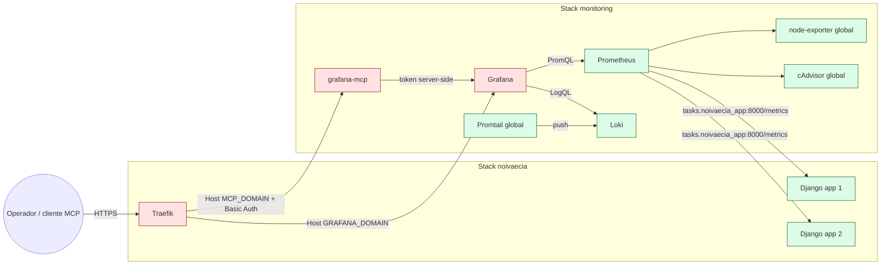
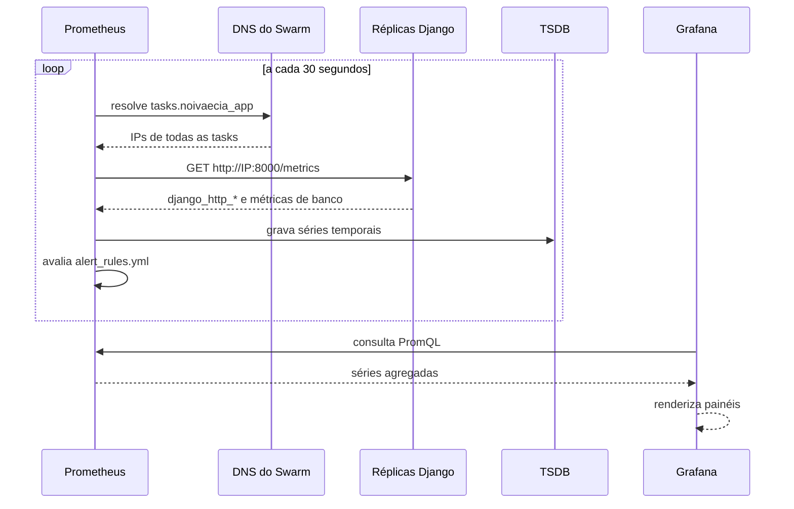
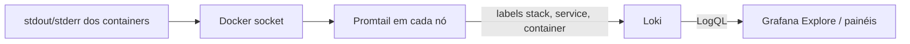
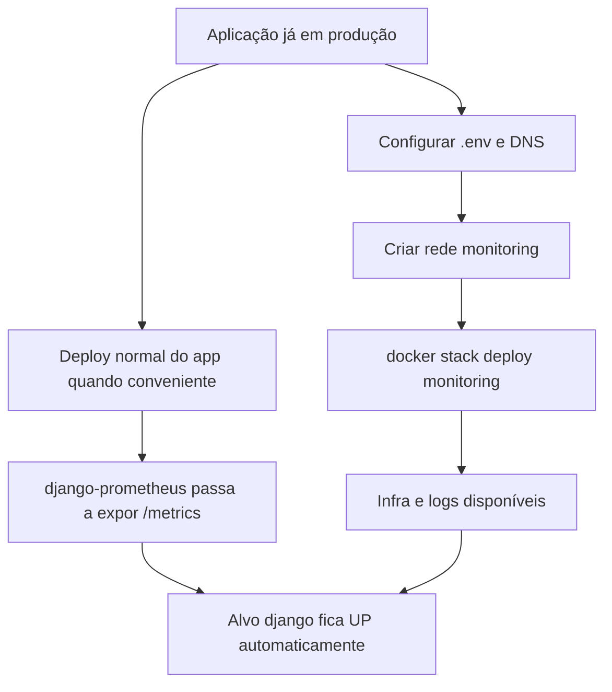
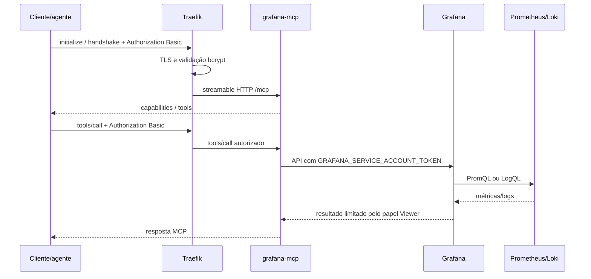
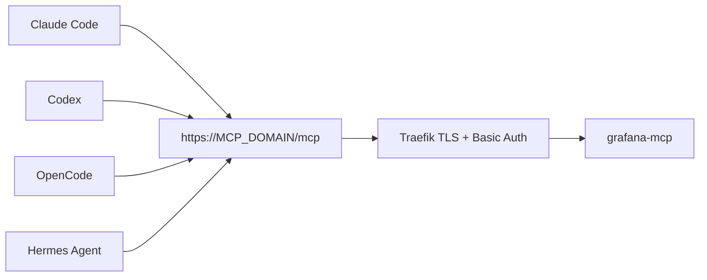
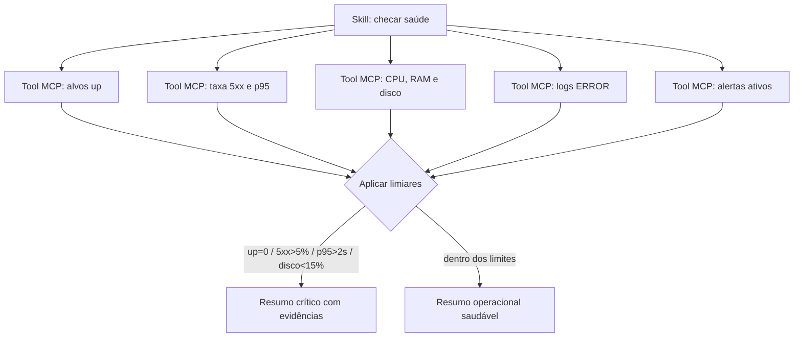

# Monitoramento, observabilidade e logs

Esta implementação acrescenta telemetria ao Noivas & Cia sem acoplar sua
operação ao deploy da aplicação. A stack `monitoring` é publicada por um arquivo
próprio, usa volumes próprios e pode subir, cair ou ser atualizada sem reconciliar
a stack `noivaecia`.

O endpoint `/metrics` só existe quando `django-prometheus` está instalado. A
guarda de import em `noivas_cia/settings.py` mantém o Django funcional quando a
biblioteca não está presente. Não há router dedicado à rota e o middleware
recusa requisições encaminhadas pelo Traefik, impedindo a exposição pública.

## Componentes

| Componente | Papel | Implantação |
|---|---|---|
| Prometheus | Coleta métricas e avalia regras de alerta | 1 réplica no manager |
| Grafana | Consulta datasources e desenha dashboards | 1 réplica no manager, TLS pelo Traefik |
| Loki | Armazena e consulta logs | 1 réplica no manager |
| Promtail | Descobre containers e envia seus logs | 1 instância por nó |
| node-exporter | CPU, RAM, disco e rede do host | 1 instância por nó |
| cAdvisor | CPU, RAM e I/O por container | 1 instância por nó |
| grafana-mcp | Ferramentas do Grafana para agentes de IA | 1 réplica no manager, TLS + Basic Auth |

Prometheus, Grafana e Loki usam volumes nomeados. Remover a stack não remove
esses volumes automaticamente.

## Arquitetura



Há duas redes overlay:

- `traefik_public`, já existente: publica Grafana e MCP e permite ao Prometheus
  alcançar as tasks Django.
- `monitoring`, criada pelos scripts: comunicação privada entre os componentes
  de observabilidade.

O DNS `tasks.noivaecia_app` retorna registros A de todas as réplicas. Escalar o
app não exige editar IPs nem redeployar a monitoria.

## Fluxo de métricas



O `PrometheusBeforeMiddleware` envolve o início da pilha e o
`PrometheusAfterMiddleware` fecha a medição no final. A engine instrumentada
mantém o backend PostgreSQL/SQLite/MySQL equivalente e acrescenta métricas de
banco.

## Fluxo de logs



Exemplos de LogQL:

```logql
{stack="noivaecia"}
{service="noivaecia_app"} |= "ERROR"
{stack="monitoring", service="monitoring_prometheus"}
```

## Deploy independente



Na primeira execução:

```bash
bash scripts/setup_monitoring.sh
```

Nos redeploys seguintes:

```bash
bash scripts/deploy_monitoring.sh
# Recria serviços, preservando volumes:
bash scripts/deploy_monitoring.sh --clean
```

O script deriva `MONITORING_CONFIG_DIR` do diretório real do repositório. Ele
faz parsing linha a linha do `.env`; nunca usa `source .env` nem
`export $(cat .env)`.

## Dashboard e datasources

O Grafana não guarda as métricas nem os logs. O modelo mental é:

```text
dashboard → painel → query → datasource → visualização
```

- Prometheus responde PromQL e guarda séries temporais.
- Loki responde LogQL e guarda logs.
- Grafana apenas consulta e apresenta os resultados.

Há três maneiras comuns de obter dashboards:

1. Criar painéis manualmente.
2. Importar um dashboard da comunidade por ID.
3. Provisionar JSON como código. Esta implementação usa essa opção em
   `monitoring/grafana/dashboards/noivas-cia-overview.json`.

O dashboard próprio inclui alvos UP, erros 5xx, throughput, requisições por
método, respostas por status, latência p50/p95/p99, CPU/memória por container e
logs da aplicação.

Para importar por ID: **Grafana → Dashboards → New → Import**, informe o número,
clique em **Load**, selecione o datasource Prometheus e clique em **Import**.

| ID | Dashboard | Observação |
|---:|---|---|
| 1860 | Node Exporter Full | CPU, RAM, disco e rede; funciona direto |
| 14282 | Cadvisor exporter | Métricas por container; funciona direto |
| 21154 | Docker overview (cAdvisor 2024) | cAdvisor + node-exporter |
| 13496 | Docker and system monitoring | Alternativa mais enxuta |
| 9528 / 17658 | Django (django-prometheus) | Usa `django_http_*` diretamente |

O `django-prometheus` não acrescenta namespace. As métricas chegam como
`django_http_...`, nunca como `noivas_cia_django_http_...`. Se um painel estiver
vazio, confira se sua query introduziu um prefixo indevido.

## Alertas, SLIs e SLOs

| Alerta | Condição | Espera | Severidade |
|---|---|---:|---|
| `ServiceDown` | `up == 0` | 1 min | critical |
| `HighMemoryUsage` | container acima de 85% do limite | 5 min | warning |
| `HighCPUUsage` | consumo acima de 0,8 CPU | 5 min | warning |
| `DiskSpaceLow` | menos de 15% livre em `/` | 5 min | critical |
| `HighDjango5xxRate` | mais de 5% de respostas 5xx | 5 min | critical |
| `HighDjangoLatencyP95` | p95 maior que 2 segundos | 5 min | warning |

Prometheus avalia e exibe essas regras. Notificações ativas por e-mail, Slack ou
Telegram exigem adicionar um Alertmanager e seus canais; isso foi mantido fora
desta stack enxuta.

SLIs/SLOs iniciais sugeridos:

| SLI | SLO inicial | Query/base |
|---|---|---|
| Disponibilidade HTTP | 99,5% mensal | proporção de respostas não-5xx |
| Taxa de erro | menos de 1% em 30 dias | `django_http_responses_total_by_status_total` |
| Latência | p95 abaixo de 2 s | histograma de latência por view/método |
| Capacidade do host | disco acima de 15% livre | node-exporter |
| Estabilidade de containers | sem OOM sustentado | cAdvisor + eventos/logs |

Antes de transformar estes valores em compromisso comercial, observe ao menos
duas semanas de tráfego real e defina orçamento de erro.

## Casos de uso

- Confirmar se todas as réplicas respondem após um deploy.
- Correlacionar pico de 5xx com logs do serviço e uso de CPU/memória.
- Identificar rotas lentas pelo histograma do Django.
- Acompanhar crescimento de disco e retenção antes de faltar espaço.
- Investigar reinícios/OOM de containers sem acessar cada task manualmente.
- Permitir que um agente read-only produza um resumo operacional via MCP.

## Servidor MCP do Grafana

O serviço usa a imagem oficial `grafana/mcp-grafana:1.0.0`, transporte
`streamable-http`, porta `8000` e endpoint `/mcp`. A tag no Docker Hub não leva
`v`; usar `v1.0.0` causa rejeição por imagem inexistente. A versão fixa foi
conferida na [release oficial](https://github.com/grafana/mcp-grafana/releases/tag/v1.0.0)
e no [Docker Hub](https://hub.docker.com/r/grafana/mcp-grafana/tags).

O MCP acessa `http://grafana:3000` pela rede privada. Para clientes remotos, o
Traefik publica `https://${MCP_DOMAIN}/mcp` com TLS e Basic Auth. A stack também
define explicitamente o endpoint, o bind `0.0.0.0:8000` e o host permitido,
compatíveis com a validação de Host do servidor atual.

### Duas credenciais diferentes

| Variável/dado | Quem usa | Onde fica |
|---|---|---|
| `GRAFANA_SERVICE_ACCOUNT_TOKEN` | MCP → Grafana | somente no ambiente server-side do container |
| `MCP_BASICAUTH_USERS` | Traefik valida o cliente | hash bcrypt `user:$2y$...` no `.env` da VPS |
| `Authorization: Basic ...` | cliente → Traefik | Base64 de `usuario:senha` em texto puro |

O cliente nunca recebe nem envia `GRAFANA_SERVICE_ACCOUNT_TOKEN`. No header
Basic vai a senha original codificada em Base64, não o hash bcrypt. Bcrypt é de
mão única; enviar `$2y$...` produz `401`. Base64 não é criptografia, por isso TLS
é obrigatório. Ao gerar a senha, guarde-a imediatamente.

No `.env`, mantenha os `$` do bcrypt simples. Como o valor entra pela expansão
de `${MCP_BASICAUTH_USERS}`, dobrar para `$$` faria o Traefik receber caracteres
extras e recusaria o login.

### Criar o Service Account

1. Entre no Grafana como administrador.
2. Abra **Administration → Users and access → Service accounts**.
3. Crie uma conta com papel `Viewer` para consultas. Use `Editor` somente se o
   agente realmente precisar alterar dashboards/alertas.
4. Gere um token, copie o valor `glsa_...` uma única vez e grave-o em
   `GRAFANA_SERVICE_ACCOUNT_TOKEN` no `.env` da VPS.
5. Rode `bash scripts/deploy_monitoring.sh`.

Para uma skill de monitoramento, `Viewer` é a escolha recomendada: as tools leem
Prometheus, Loki e alertas, mas não alteram dashboards.

### Fluxo de uma consulta MCP



### Vários clientes, um endpoint



Cada cliente deve guardar o mesmo header em seu mecanismo de segredo local; não
grave a senha real em arquivos versionados.

### Exemplos de cliente remoto

Calcule o header uma vez na máquina do operador:

```bash
printf '%s' 'usuario:senha-original' | base64
```

Claude Code com transporte HTTP:

```bash
claude mcp add --transport http grafana https://mcp.exemplo.com/mcp \
  --header "Authorization: Basic <BASE64_USUARIO_SENHA>"
```

Claude Desktop, ou qualquer cliente que aceite apenas stdio, via bridge:

```json
{
  "mcpServers": {
    "grafana": {
      "command": "npx",
      "args": [
        "-y",
        "mcp-remote",
        "https://mcp.exemplo.com/mcp",
        "--header",
        "Authorization: Basic <BASE64_USUARIO_SENHA>"
      ]
    }
  }
}
```

O mesmo bridge pode ser executado diretamente:

```bash
npx -y mcp-remote https://mcp.exemplo.com/mcp \
  --header "Authorization: Basic <BASE64_USUARIO_SENHA>"
```

Cursor (`.cursor/mcp.json`):

```json
{
  "mcpServers": {
    "grafana": {
      "url": "https://mcp.exemplo.com/mcp",
      "headers": {
        "Authorization": "Basic <BASE64_USUARIO_SENHA>"
      }
    }
  }
}
```

VS Code (`.vscode/mcp.json`):

```json
{
  "servers": {
    "grafana": {
      "type": "http",
      "url": "https://mcp.exemplo.com/mcp",
      "headers": {
        "Authorization": "Basic ${input:grafanaMcpAuth}"
      }
    }
  },
  "inputs": [
    {
      "id": "grafanaMcpAuth",
      "type": "promptString",
      "description": "Base64 de usuario:senha do MCP",
      "password": true
    }
  ]
}
```

Codex (`~/.codex/config.toml`), conforme a
[documentação oficial do Codex](https://developers.openai.com/codex/mcp/):

```toml
[mcp_servers.grafana]
url = "https://mcp.exemplo.com/mcp"
http_headers = { Authorization = "Basic <BASE64_USUARIO_SENHA>" }
```

A documentação oficial do Grafana mantém mais exemplos em
[client-configuration-examples](https://github.com/grafana/mcp-grafana/blob/v1.0.0/docs/sources/set-up/client-configuration-examples.md).

### Alternativa local stdio

Para não publicar um endpoint remoto, execute o MCP na máquina do cliente. Aqui
o token do Service Account é passado diretamente ao processo local:

```bash
docker run --rm -i \
  -e GRAFANA_URL=https://grafana.exemplo.com \
  -e GRAFANA_SERVICE_ACCOUNT_TOKEN=glsa_... \
  grafana/mcp-grafana:1.0.0 -t stdio
```

Neste modo não existe Basic Auth/Traefik entre cliente e processo; proteja o
token no gerenciador de segredos do cliente.

### Skill de monitoramento read-only



Uma execução recomendada pede ao agente: verificar alvos `up`, taxa de 5xx,
p95, CPU/memória, disco, alertas ativos e erros recentes; depois resumir cada
violação com janela de tempo e query usada. Não autorize mutações para essa
skill.

## Troubleshooting

### Painéis Django em “no data”: 400 `DisallowedHost`

O Prometheus acessa o IP interno da task e esse IP dinâmico não está em
`ALLOWED_HOSTS`. O Django responde 400 antes de expor métricas. O
`MetricsHostMiddleware`, posicionado antes do `SecurityMiddleware`, reescreve o
Host somente para scrapes diretos de `/metrics`. Ele também retorna 404 quando o
Traefik encaminha a rota pública. Não acrescente curingas inseguros a
`ALLOWED_HOSTS`.

### Alvo Django DOWN: 301 e conexão recusada na 443

Com `SECURE_SSL_REDIRECT=True`, o scrape HTTP interno pode receber 301 para
`https://.../metrics`. O container não escuta 443, então o erro seguinte costuma
ser `connection refused`. A correção é manter:

```python
SECURE_REDIRECT_EXEMPT = [r'^healthz/$', r'^metrics$']
```

Os dois problemas acima têm o mesmo sintoma visual (“no data”), mas diagnósticos
diferentes no Prometheus: um retorna 400; o outro mostra 301/porta 443.

### Alvo Django DOWN logo após instalar a monitoria

É esperado até a imagem do app incluir `django-prometheus`. Rode o deploy normal
do app quando conveniente. A monitoria e o site continuam independentes.

### Sem logs no Loki

```bash
docker service logs monitoring_promtail
docker service logs monitoring_loki
```

Confirme acesso ao socket Docker e a presença dos labels `stack`, `service` e
`container`. A query mais ampla é `{stack="noivaecia"}`.

### Grafana indisponível após o deploy

Confira propagação DNS, emissão TLS e tasks:

```bash
docker service ps monitoring_grafana
docker service logs monitoring_grafana
docker service logs noivaecia_traefik
```

### MCP retorna 401, 403 ou 502

- `401`: o cliente provavelmente enviou o hash bcrypt ou senha incorreta. Envie
  Base64 de `usuario:senha-original`.
- `403`: confira `MCP_DOMAIN`; a versão atual valida o header Host.
- `502`: confirme se o token `glsa_...` foi configurado e veja
  `docker service logs monitoring_grafana-mcp`.
- `Rejected: No such image`: use a tag Docker sem `v`, atualmente `1.0.0`.

Nunca imprima o token do Service Account, a senha do Grafana ou o conteúdo do
`.env` em tickets e logs.
